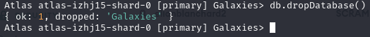

# MongoDB Setup and Management using Docker

## Objectives
Students will learn how to set up MongoDB using Docker, manage databases and collections, create backups, and restore data using terminal commands in Bash or PowerShell.

## Prerequisites:
- Basic understanding of Docker
- Access to a terminal (Bash for Linux/MacOS, PowerShell for Windows)
- Docker installed on your machine

## Step 1: Pull the MongoDB Docker Image

1. From your terminal, create a new directory for your MongoDB data

2. Pull the MongoDB Docker image from Docker Hub.

3. Run a MongoDB container using the image you just pulled.

4. Verify that the container is running.
    ```bash
    docker ps
    ```
    You should see the MongoDB container running.


## Step 2: Connect to the MongoDB Container

Connect to the MongoDB container to your Atlas Cluster using the following command:
```bash
docker exec -it <container_id> mongosh "mongodb+srv://cluster0.7zv8v.mongodb.net/<dbname>" --username <username> --password <password>
```


## Step 3: Create a Database and Collection

- Create a new database called **Galaxies**.
- Create a new collection called **Stars**.

- Insert 5 new documents into the **Stars** collection.


**PS: Characteristics for stars:**
- Name
- Type
- Age
- Distance from Earth

- Query the **Stars** collection to verify that the document was inserted.

- Create a new collection called **Planets**.
- Insert 5 new documents into the **Planets** collection.


**PS: Characteristics for planets:**
- Name
- Type
- Number of Moons
- Distance from the Sun

- Create indexes on the **Name** field for both the **Stars** and **Planets** collections.


## Step 4: Backup and Restore Data

- Create a backup of the **Galaxies** database.

- Delete the **Galaxies** database.

- Restore the **Galaxies** database from the backup and name it **Galaxies**.

- Verify that the **Galaxies** database has been restored successfully.


## Step 5: Configure Role-Based Access Control

- Create a new user with the **readWrite** role for the **Galaxies** database.

- Connect to the **Galaxies** database using the new user credentials.

- Insert a new document into the **Stars** collection.

- Verify that the document was inserted successfully.


## Step 6: Write a Docker Compose File and a Shell Script

- Write a Docker Compose file that sets up a MongoDB container with the following configurations:
  - Use the latest MongoDB image from Docker Hub.
  - Set the container name to **mongodb_container**.
  - Expose port **27017** on the host machine.
  - Mount the `./data` directory on the host machine to the `/data/db` directory in the container.

- Write a shell script that automates the following tasks:
  - Pull the MongoDB Docker image.
  - Run a MongoDB container using the image you just pulled.
  - Verify that the container is running.
  - Connect to the MongoDB container using the mongo shell.
  - Create a new database called **Galaxies**.
  - Create a new collection called **Stars**.
  - Insert 5 new documents into the **Stars** collection.
  - Query the **Stars** collection to verify that the document was inserted.
  - Create a new collection called **Planets**.
  - Insert 5 new documents into the **Planets** collection.
  - Create indexes on the **Name** field for both the **Stars** and **Planets** collections.
  - Create a backup of the **Galaxies** database.

- Run the shell script and verify that all the tasks are completed successfully.

Voir le script setup-docker.sh et le docker-compose.yml
