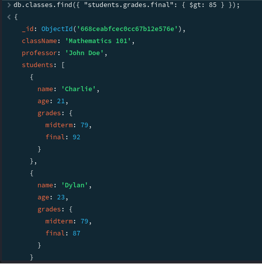
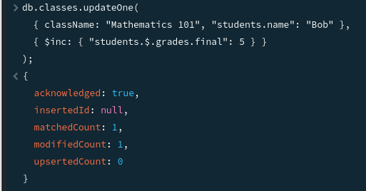
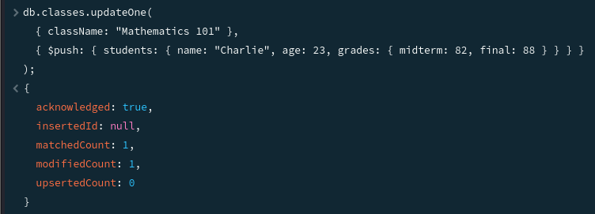
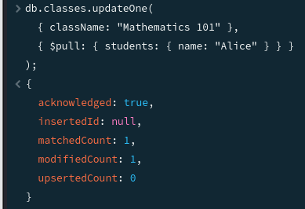
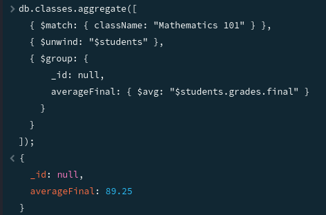
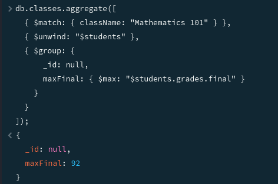

# Exercice sur la Manipulation de Documents Imbriqués avec MongoDB

Cet exercice vous permettra de pratiquer la manipulation de documents MongoDB contenant des structures de données imbriquées.

## Contexte

Vous travaillez avec une base de données `schoolDB` qui contient une collection `classes`. Chaque document dans la collection `classes` représente une classe et contient des informations sur le professeur, les étudiants, et les cours. Les étudiants sont représentés par un tableau d'objets imbriqués dans chaque document de classe.

```json

db.classes.insertOne({
  className: "Mathematics 101",
  professor: "John Doe",
  students: [
    {
      name: "Alice",
      age: 20,
      grades: {
        midterm: 80,
        final: 90
      }
    },
    {
      name: "Bob",
      age: 22,
      grades: {
        midterm: 75,
        final: 85
      }
    }
  ]
});

```

## Instructions

### Partie 1: Préparation

1. **Sélection de la Base de Données :**
   - Utilisez `use schoolDB` pour sélectionner la base de données.

2. **Création de la Collection :**
   - Créez une collection `classes` avec `db.createCollection("classes")`.

### Partie 2: Insertion de Données

1. **Insertion d'un Document :**
   - Insérez un document dans la collection `classes` qui représente une classe avec les informations suivantes :
     ```javascript
     db.classes.insertOne({
       className: "Mathematics 101",
       teacher: "John Doe",
       students: [
         { name: "Charlie", age: 21, grades: { midterm: 79, final: 92 } },
         { name: "Dylan", age: 23, grades: { midterm: 79, final: 87 } }
       ]
     });
     ```

### Partie 3: Requêtes sur Documents Imbriqués

1. **Recherche d'Étudiants :**
   - Récupérez tous les documents de la classe où au moins un étudiant a obtenu plus de 85 au final.
     ```javascript
     db.classes.find({ "students.grades.final": { $gt: 85 } });
     ```
      

2. **Mise à Jour d'un Document Imbriqué :**
   - Augmentez de 5 points le `final` de Bob dans "Mathematics 101".
     ```javascript
     db.classes.updateOne(
       { className: "Mathematics 101", "students.name": "Bob" },
       { $inc: { "students.$.grades.final": 5 } }
     );
     ```
     

### Partie 4: Ajout et Suppression d'Éléments Imbriqués

1. **Ajout d'un Étudiant :**
   - Ajoutez un nouvel étudiant nommé "Charlie" avec un âge de 23 et des notes de midterm 82, final 88 à "Mathematics 101".
     ```javascript
     db.classes.updateOne(
       { className: "Mathematics 101" },
       { $push: { students: { name: "Charlie", age: 23, grades: { midterm: 82, final: 88 } } } }
     );
     ```
     

2. **Suppression d'un Étudiant :**
   - Supprimez l'étudiant Alice de "Mathematics 101".
     ```javascript
     db.classes.updateOne(
       { className: "Mathematics 101" },
       { $pull: { students: { name: "Alice" } } }
     );
     ```
     

### Partie 5: Aller Plus Loin avec les Agrégations

Maintenant que vous avez pratiqué l'insertion, la mise à jour, et la suppression de documents dans MongoDB, explorons les capacités puissantes d'agrégation pour analyser les données de manière plus complexe.

#### Contexte

La collection `classes` dans `schoolDB` contient des informations détaillées sur différentes classes, incluant les professeurs et les étudiants. Chaque étudiant a des notes pour les examens de mi-session et finaux.

#### Objectif

Utilisez le framework d'agrégation de MongoDB pour calculer la note moyenne finale de la classe "Mathematics 101".

#### Instructions

1. **Calcul de la Moyenne :**
   - Écrivez une requête d'agrégation pour calculer la note moyenne finale des étudiants de "Mathematics 101".
     ```javascript
     db.classes.aggregate([
       { $match: { className: "Mathematics 101" } },
       { $unwind: "$students" },
       { $group: {
           _id: null,
           averageFinal: { $avg: "$students.grades.final" }
         }
       }
     ]);
     ```
     

2. **Trouver la Note Maximale :**
   - Écrivez une requête d'agrégation pour trouver la note finale maximale des étudiants de "Mathematics 101".
     ```javascript
     db.classes.aggregate([
       { $match: { className: "Mathematics 101" } },
       { $unwind: "$students" },
       { $group: {
           _id: null,
           maxFinal: { $max: "$students.grades.final" }
         }
       }
     ]);
     ```
     

## Validation

Vérifiez vos résultats à l'aide de capture décran.

## Conseils

- Utilisez `db.classes.insertOne()` pour insérer des documents.
- Pour les requêtes sur documents imbriqués, vous devrez peut-être utiliser des opérateurs comme `$elemMatch`.
- Lors de la mise à jour de documents imbriqués, utilisez des chemins de champs dotés, par exemple, `students.$.grades.final`.
- Pour ajouter un élément à un tableau, utilisez l'opérateur `$push`.
- Pour supprimer un élément d'un tableau basé sur une condition, utilisez l'opérateur `$pull`.
