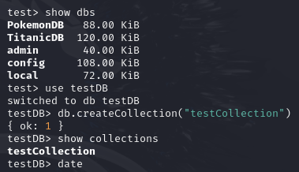
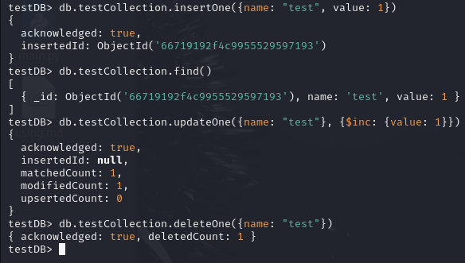
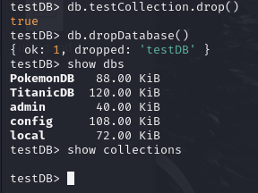

# Exercice Pratique sur l'Utilisation de Mongo Shell (mongosh)

### Partie 1: Exploration des Bases de Données et Collections

1. **Connexion :** 
   - Lancez `mongosh` pour démarrer le shell MongoDB.

2. **Lister les Bases de Données :**
   - Utilisez la commande `show dbs` pour afficher toutes les bases de données existantes.

3. **Sélectionner une Base de Données :**
   - Utilisez la commande `use` suivie du nom d'une base de données existante ou d'une nouvelle pour la sélectionner. Par exemple, `use testDB`.

4. **Créer une Collection :**
   - Créez une nouvelle collection nommée `testCollection` en utilisant `db.createCollection("testCollection")`.

5. **Afficher les Collections :**
   - Utilisez la commande `show collections` pour lister toutes les collections de la base de données actuelle.

    

### Partie 2: Manipulation des Données

1. **Insertion de Données :**
   - Insérez un document dans `testCollection` avec `db.testCollection.insertOne({name: "test", value: 1})`.

2. **Lecture de Données :**
   - Utilisez `db.testCollection.find()` pour afficher tous les documents dans `testCollection`.

3. **Mise à Jour de Données :**
   - Mettez à jour le document précédemment inséré en augmentant `value` de 1 avec `db.testCollection.updateOne({name: "test"}, {$inc: {value: 1}})`.

4. **Suppression de Données :**
   - Supprimez le document avec `db.testCollection.deleteOne({name: "test"})`.

   

### Partie 3: Nettoyage

1. **Suppression de Collection :**
   - Supprimez `testCollection` en utilisant `db.testCollection.drop()`.

2. **Suppression de Base de Données :**
   - Supprimez la base de données `testDB` (assurez-vous d'avoir sélectionné `testDB`) avec `db.dropDatabase()`.

## Validation

À chaque étape, utilisez les commandes appropriées pour vérifier que vos actions ont été correctement exécutées. Cela comprend l'utilisation de `find()`, `show dbs`, et `show collections` pour confirmer les modifications apportées à la base de données et aux collections.

